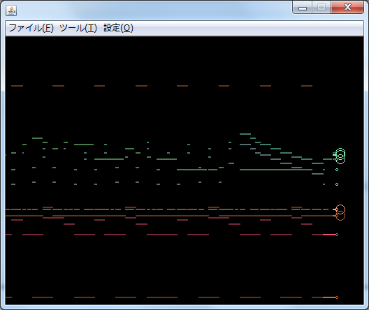
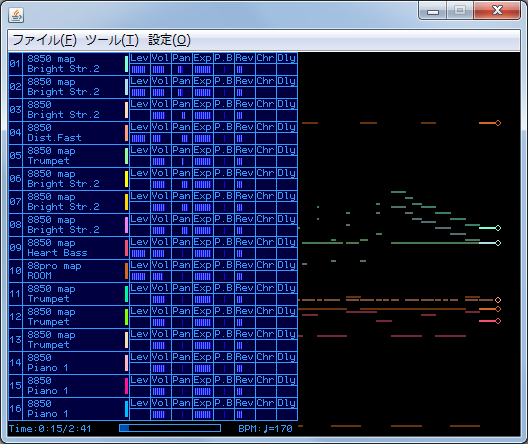
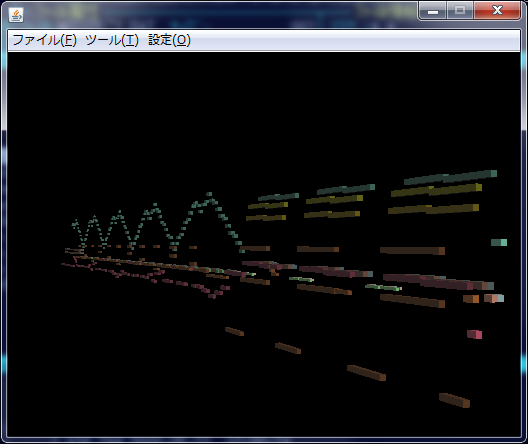
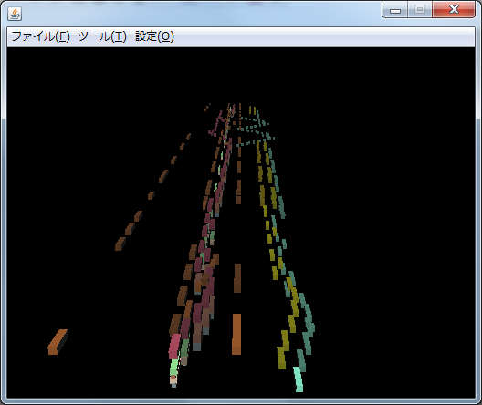
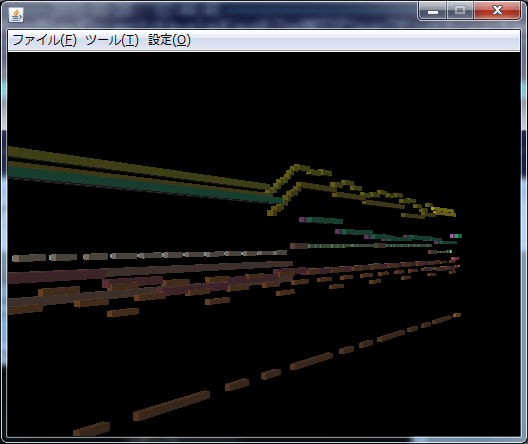

# MIDIPlayer (Old Version)

Migrated from SourceForge to GitHub  https://osdn.net/projects/midiplayer/

- This repository was created by Hiroaki@R-Koubou, the author of this software.

- このリポジトリを作成した Hiroaki@R-Koubou はこのソフトウェアの作者です。

- **The source code will not be maintained, but will be restarted in the future with a new repository.**

- **ソースコードのメンテナンスは行いませんが、将来的には新しいリポジトリで再スタートする予定です。**

## Table of Contents

<!-- TOC -->

- [MIDIPlayer (Old Version)](#midiplayer-old-version)
  - [Table of Contents](#table-of-contents)
    - [Download](#download)
    - [Project Summary](#project-summary)
    - [Player Overview](#player-overview)
    - [Screenshots](#screenshots)
    - [Auther](#auther)
    - [Licence](#licence)
  - [日本語](#日本語)
    - [ダウンロード](#ダウンロード)
    - [プロジェクト概要](#プロジェクト概要)
    - [プレーヤー概要](#プレーヤー概要)
    - [スクリーンショット](#スクリーンショット)
    - [作者](#作者)
    - [ライセンス](#ライセンス)

<!-- /TOC -->

### Download

https://github.com/r-koubou/MIDIPlayer.Old/releases/latest

### Project Summary

It is a GUI MIDI player program that plays MIDI data using Java SE.
Especially, it has a mechanism to increase the variation of the screen display during playback.
It was created with interactivity and entertainment in mind.

### Player Overview

I have been posting MIDI videos on Nico Nico Douga, and suddenly thought that there should be a software that is the sum of TMIDI Player and MAMPlayer divided by two. (Currently, it's more for capturing the playback screen of MIDI data I've created than for viewing.

This software is designed to capture video at 512x384, which is the video size available on Nico Nico Douga, without resizing.

The features are as follows.

- MAMPlayer has a limitation that does not send exclusive data, etc. (It is described in the limitation of MAMPlayer manual.) This software is not filtered.
- Screen rendering is separated from the player itself as a plug-in, so it can be added without modifying the application itself
- By setting up a MIDI IN device such as a MIDI keyboard, it is possible to input MIDI file data while it is being played back, or to input data in real time.

### Screenshots

### Auther

R-Koubou (previous name: rz) [@rkoubou_jp](https://twitter.com/rkoubou_jp)

### Licence

- [MIDIPlayer](player/license/LICENSE.txt)
- [JOGL](player/license/jogl/LICENSE-JOGL-1.1.1.txt)

## 日本語

### ダウンロード

https://github.com/r-koubou/MIDIPlayer.Old/releases/latest

### プロジェクト概要

Java SE を使用した MIDIデータ再生を行う GUI MIDIプレーヤープログラムで
特に再生中の画面表示については、バリエーションを増やしていける機構を持っていることが特徴で
インタラクティブ、エンターテインメント性を念頭に作成を行っています。

### プレーヤー概要

作者自身が MIDI 系の動画をニコニコ動画に投稿していて、ふと TMIDI Player と MAMPlayer を足して２で割ったソフトがあればなぁと思い作りはじめました。 （現状、観賞用というよりかは、自身で作成したMIDIデータの再生画面キャプチャ用を想定しています）

ニコニコ動画で使用可能な動画サイズである 512x384 での表示を行い、リサイズ無しでキャプチャすることを視野に入れています。

特徴としてはこんな感じです。

- MAMPlayer ではエクスクルーシブデータなどが送信されない制限事項がありますが（MAMPlayer のマニュアルの制限事項に記載されています）本ソフトはフィルタは掛けていません
- 画面レンダリングをプレーヤー本体からプラグインとして分離しているので、アプリ本体のプログラムを修正することなく追加が可能です
- MIDI キーボードなどのMIDI IN デバイスの設定を行うことで、MIDI ファイルのデータ再生中の入力や、リアルタイム入力を行うことが可能です

### スクリーンショット

### 作者

R-Koubou (旧 rz) [@rkoubou_jp](https://twitter.com/rkoubou_jp)

### ライセンス

- [MIDIPlayer](player/license/LICENSE.txt)
- [JOGL](player/license/jogl/LICENSE-JOGL-1.1.1.txt)

